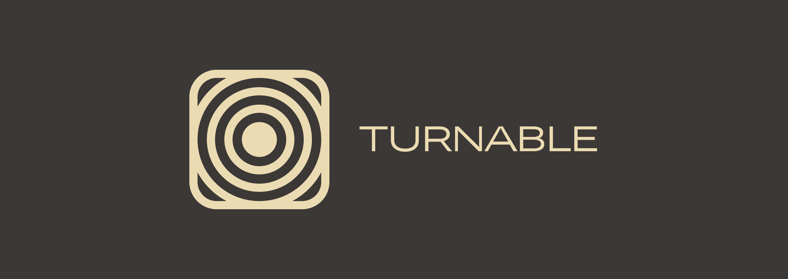

# Turnable

## DISCLAIMER:
Warning! App contains a lot of trash code and is still in development!
Please, understand that this is my first ever usable app made, thanks!
## Ooo! What is this?
Turnable is a player that allows users to play files from network with streaming over HTTP. It uses ExoPlayer2 as it's base and has a pretty slick design.
## Why does this thing exist...
This was created as a final project for a Samsung Innovation Campus IT School course. Pretty fun thing to do, let me say!
## Thanks to...
[Morhetz](https://github.com/morhetz) for his amazing [gruvbox color scheme](https://github.com/morhetz/gruvbox)

[Google](https://github.com/google) for an amazing [exoplayer library](https://github.com/google/ExoPlayer)

[Jetbrains](https://github.com/JetBrains) team for their amazing [jetbrains mono font](https://github.com/JetBrains/JetBrainsMono)

You for playing your [favourite song](https://youtu.be/dQw4w9WgXcQ) there! (like, seriously, thank you)
